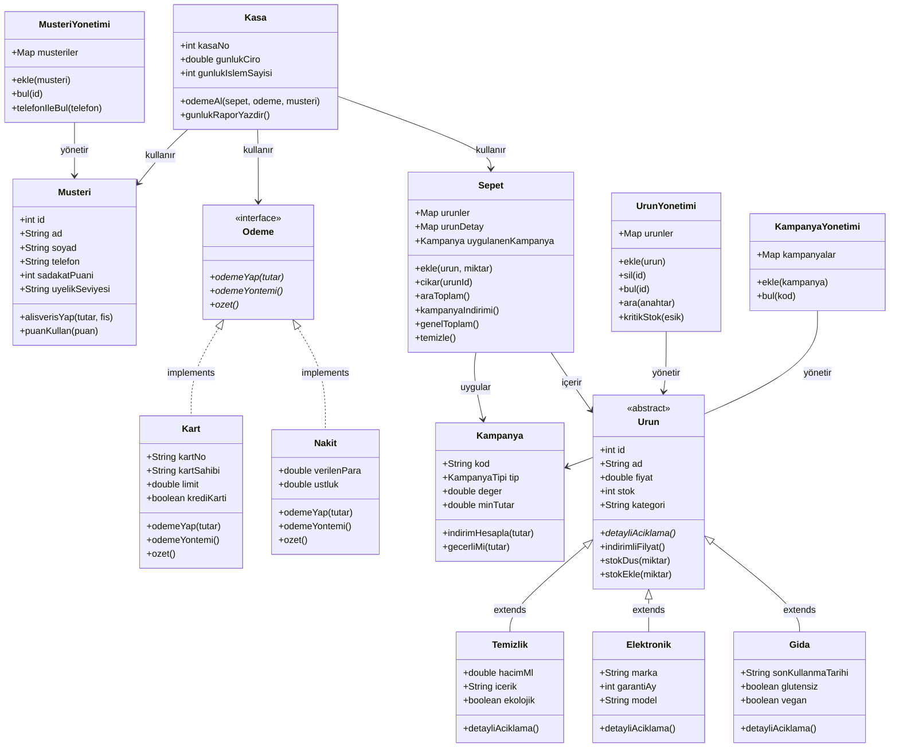

[README.md](https://github.com/user-attachments/files/27390400/README.2.md)

# MarketKasaSistemi 🛒

Nesne Tabanlı Programlama dersi kapsamında geliştirilen Java tabanlı market kasa simülasyonu.

---

## Sınıf Diyagramı



---

## Kullanılan OOP Kavramları

| Kavram | Nerede |
|---|---|
| **Soyut Sınıf** | `Urun` — `abstract class` + `abstract detayliAciklama()` |
| **Kalıtım** | `Gida`, `Elektronik`, `Temizlik` → `extends Urun` |
| **Arayüz** | `Odeme` interface → `Nakit` ve `Kart` implement eder |
| **Polimorfizm** | `Kasa.odemeAl(Odeme odeme)` — Nakit veya Kart fark etmez |
| **Kapsülleme** | Tüm sınıflarda `private` alanlar + getter/setter |
| **Kompozisyon** | `Kasa` içinde `Sepet` + `Odeme` + `Musteri` bir arada |
| **Enum** | `Kampanya.KampanyaTipi` |

---

## Proje Yapısı

```
MarketKasaSistemi/
└── src/
    ├── Urun.java             → Soyut temel sınıf
    ├── Gida.java             → Ürün alt sınıfı
    ├── Elektronik.java       → Ürün alt sınıfı
    ├── Temizlik.java         → Ürün alt sınıfı
    ├── Odeme.java            → Arayüz (interface)
    ├── Nakit.java            → Ödeme implementasyonu
    ├── Kart.java             → Ödeme implementasyonu
    ├── Kampanya.java         → İndirim/kampanya sistemi
    ├── Musteri.java          → Müşteri + sadakat puanı
    ├── Sepet.java            → Alışveriş sepeti
    ├── Kasa.java             → Ödeme, fiş, rapor
    ├── UrunYonetimi.java     → Ürün CRUD + arama
    ├── MusteriYonetimi.java  → Müşteri CRUD
    ├── KampanyaYonetimi.java → Kampanya yönetimi
    └── Main.java             → Konsol menüsü
```

---

## Görev Dağılımı

| Kişi | Sorumluluk | Dosyalar |
|---|---|---|
| **Emre Kurtuldu** | Ürün modeli, kalıtım | `Urun.java`, `Gida.java`, `Elektronik.java`, `Temizlik.java` |
| **Batuhan Karabaş** | Müşteri & sadakat puanı | `Musteri.java`, `MusteriYonetimi.java` |
| **Furkan Korunur** | Kampanya & indirim | `Kampanya.java`, `KampanyaYonetimi.java` |
| **Ataberk Ergin** | Sepet & kasa , Ödeme sistemi & interface | `Odeme.java`, `Nakit.java`, `Kart.java` | `Sepet.java`, `Kasa.java` |
| **Zeki Enis Öztürk** | Ana menü, entegrasyon | `Main.java`, `UrunYonetimi.java` |

---

## Derleme & Çalıştırma

```bash
# src klasöründeyken derle
javac -encoding UTF-8 -d ../out *.java

# Çalıştır
cd ../out
java Main
```
